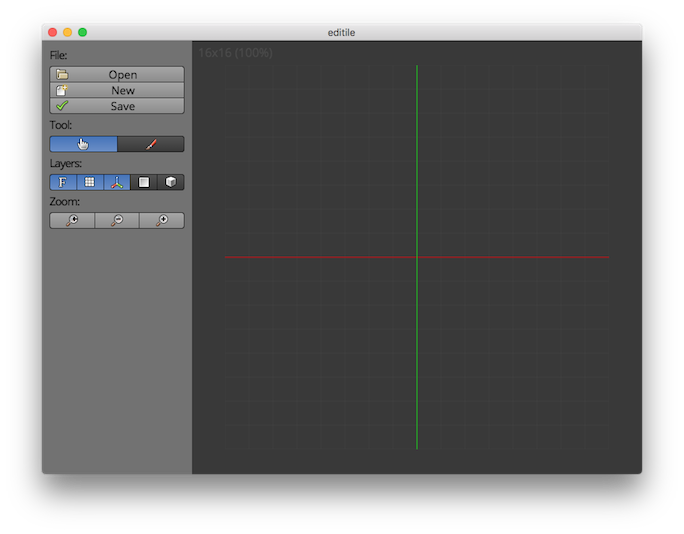

# editile

Simple level editor



## API

```javascript
const editile = require('editile')
const editor = new editile.Editor()

editor.init({
  selector: '#editor',
  tools: [
    ...
  ],
  layers: [
    ...
  ],
  sprites: [
    ...
  ]
})

editor.on('ready', function () {
  // TODO: Custom logic
})
```

### Layers

```javascript
const util = require('util')
const Layer = require('editile').Layer

function MyLayer () {
  Layer.call(this)  
}

MyLayer.prototype.id = 'my-layer'
MyLayer.prototype.label = 'My Layer'
MyLayer.prototype.zIndex = 1337

MyLayer.prototype.render = function (context) {
  // TODO: Render layer
}

util.inherits(MyLayer, Layer)

exports.MyLayer = MyLayer
```

### Tools

```javascript
const util = require('util')
const Tool = require('editile').Tool

function MyTool () {
  Tool.call(this)
}

MyTool.prototype.id = 'my-tool'
MyTool.prototype.label = 'My Tool'

MyTool.prototype.activate = function (editor) {
  // TODO: Activation logic
}

MyTool.prototype.deactivate = function (editor) {
  // TODO: Deactivation logic
}

MyTool.prototype.mouseDown = function (event, editor) {
  // Get relative mouse coordinate
  let point = editor.transformInput(event)

  // TODO: Handle mouse press event
}

MyTool.prototype.mouseUp = function (event, editor) {
  // TODO: Handle mouse release event
}

MyTool.prototype.mouseMove = function (event, editor) {
  // TODO: Handle mouse move event
}

/* OPTIONAL */
MyTool.prototype.render = function (context) {
  // TODO: Render tool
}

util.inherits(MyTool, Tool)
```
